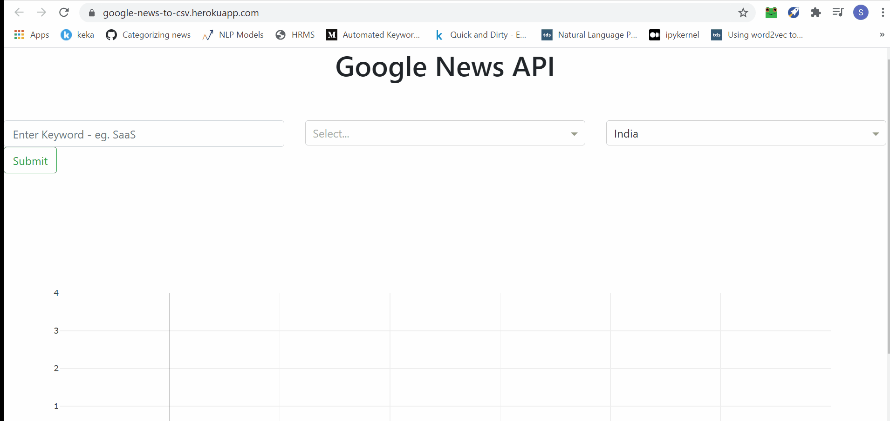

# Google News to Csv

**Overview:** Front end for Google News which displays the news in a DataFrame format which you can then export it to your local drive.

You can access the app [here](https://google-news-to-csv.herokuapp.com/).

*Disclaimer: The first time when you open this app, it may take a few seconds to load.*

## Limitations:
1. Since I'm using Google News's API, they have their own algorithm of showing news according to relevance. 
2. At a single request, only 100 news can be displayed (10 per page).
3. Body/Author is not displayed.
